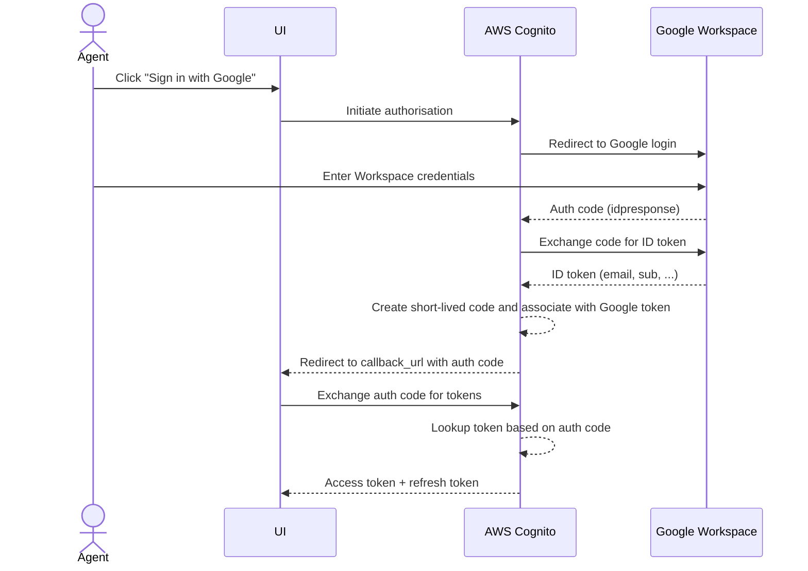
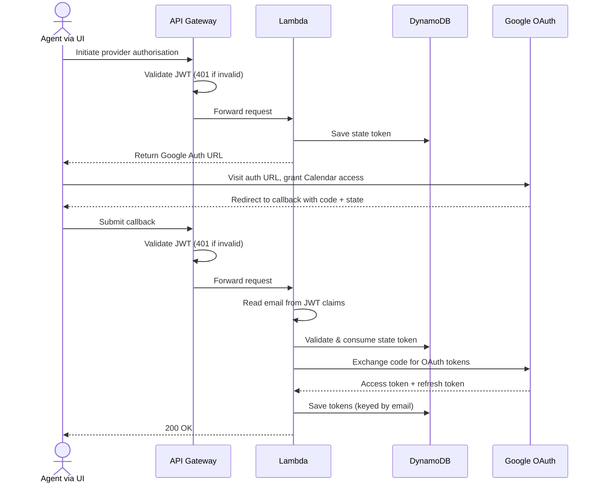

# agent-service

This service has nothing to do with AI agents.

This service is the Agent domain — responsible for all agent-related actions.

## Workflows

### 1. Authenticating Agents using SSO (Google Workspace)

Agents authenticate to the service via Google Workspace SSO, brokered through AWS Cognito. On success, Cognito issues a JWT access token used to authorise all subsequent API calls.

---

### 2. Authorising Access to Google Calendar

Once authenticated, an agent authorises the service to access Google Calendar on their behalf. The service stores the resulting OAuth tokens in DynamoDB, keyed by the agent's email (sourced from their Cognito JWT — not caller-supplied).

---

## Lambdas

### Auth Lambda (`cmd/auth`)

Handles provider OAuth flows on behalf of authenticated agents. All routes require a valid Cognito JWT (`Authorization: Bearer <token>`).

#### `GET /auth/{provider}`

Initiates an OAuth authorisation flow for the given provider.

| | |
|---|---|
| **Auth** | `Authorization: Bearer <cognito_access_token>` |
| **Path param** | `provider` — the OAuth provider (e.g. `google`) |
| **Response 200** | `{ "url": "<provider_auth_url>" }` |
| **Response 400** | `{ "error": "unsupported provider" }` |
| **Response 401** | JWT missing, invalid, or expired (rejected by API Gateway before Lambda) |

#### `POST /auth/{provider}/callback`

Exchanges the provider auth code for OAuth tokens and persists them. The agent email is read from the 'claims' field in the JWT.

| | |
|---|---|
| **Auth** | `Authorization: Bearer <cognito_access_token>` |
| **Path param** | `provider` — the OAuth provider (e.g. `google`) |
| **Request body** | `{ "code": "<auth_code>", "state": "<state_token>" }` |
| **Response 200** | `{}` |
| **Response 400** | `{ "error": "unsupported provider" }` or `{ "error": "invalid or expired state" }` |
| **Response 401** | JWT missing, invalid, or expired (rejected by API Gateway before Lambda) |

---

## Infrastructure

- **AWS API Gateway v2 (HTTP API)** — routes requests, enforces JWT auth via Cognito authorizer
- **AWS Lambda** — handles `GET /auth/{provider}` and `POST /auth/{provider}/callback`
- **AWS Cognito** — agent identity, Google Workspace SSO federation
- **AWS DynamoDB** — stores OAuth state tokens and provider access/refresh tokens
- **Terraform** — all infrastructure managed as code, deployed via Terraform Cloud