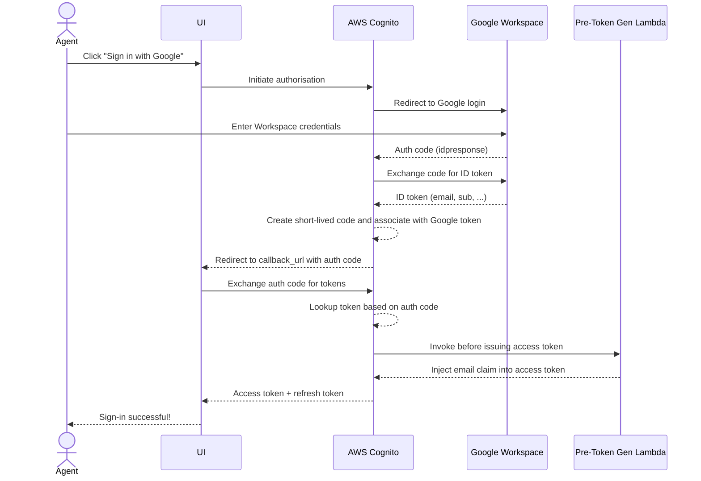
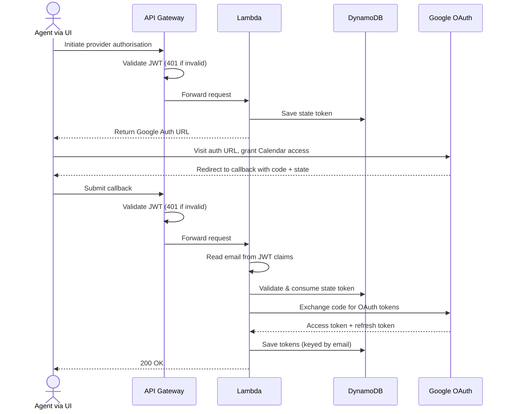
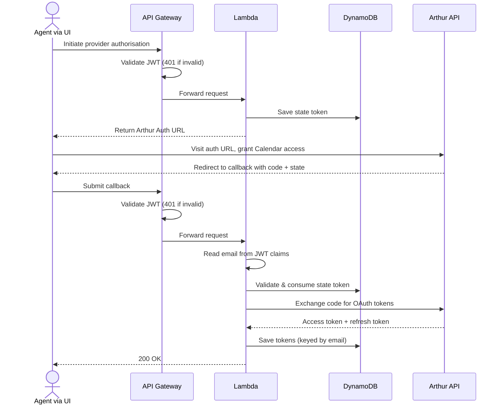
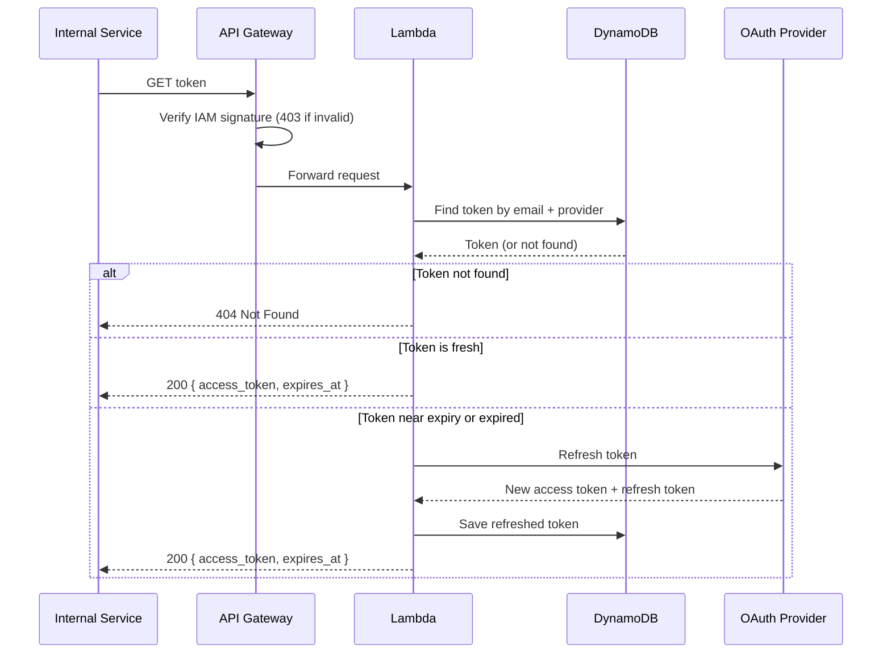
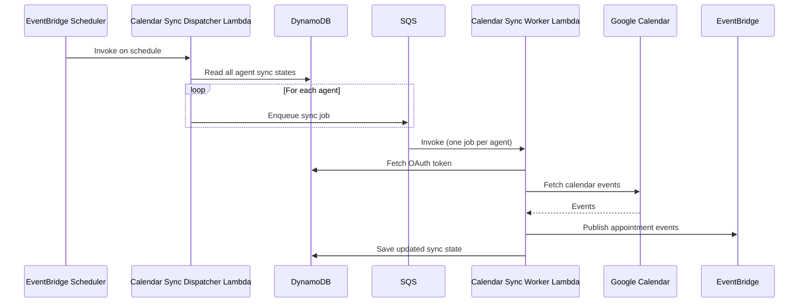

# agent-service

This service has nothing to do with AI agents.

This service is the Agent domain — responsible for all agent-related actions.

## Workflows

### 1. Authenticating Agents using SSO (Google Workspace)

Agents authenticate to the service via Google Workspace SSO, brokered through AWS Cognito. On success, Cognito issues a JWT access token used to authorise all subsequent API calls.

---

### 2. Authorising Access to Google Calendar

Once authenticated, an agent authorises the service to access Google Calendar on their behalf. The service stores the resulting OAuth tokens in DynamoDB, keyed by the agent's email (sourced from their Cognito JWT).

---

### 3. Authorising Access to Arthur

Once authenticated, an agent authorises the service to access Arthur on their behalf. The service stores the resulting OAuth tokens in DynamoDB, keyed by the agent's email (sourced from their Cognito JWT).

---

### 4. Getting a Valid Token (Internal Services)

Internal services call this endpoint to retrieve a valid access token for a given agent and provider. The service transparently refreshes the token if it is near expiry or expired, persisting the new token before returning it. Authentication is via AWS IAM (SigV4 signing).

---

### 5. Calendar Sync (Scheduled Fan-Out)

An EventBridge Scheduler triggers the dispatcher Lambda on a configurable interval. It reads all agents from DynamoDB and enqueues one SQS message per agent. The worker Lambda processes each message independently — fetching a fresh OAuth token, syncing Google Calendar, and publishing appointment events to the EventBridge event bus.

---

## Lambdas

### Calendar Sync Dispatcher Lambda (`cmd/calendar-sync-dispatcher`)

Triggered by EventBridge Scheduler on a configurable interval. Reads all agent sync states from DynamoDB and enqueues one SQS message per agent for the worker to process.

---

### Calendar Sync Worker Lambda (`cmd/calendar-sync-worker`)

Triggered by SQS (batch size 1, one invocation per agent). Fetches a fresh OAuth token, syncs the agent's Google Calendar, publishes appointment events to the EventBridge event bus, and saves the updated sync state to DynamoDB. Failed messages are retried up to three times before being moved to the dead-letter queue.

---

### Cognito Pre-Token Generation Lambda (`cmd/cognito-pre-token-gen`)

Cognito Pre-Token Generation V2 trigger. Invoked by Cognito before issuing an access token, it injects the `email` claim so it is available to the auth Lambda via the API Gateway JWT authorizer.

---

### Auth Lambda (`cmd/auth`)

Handles provider OAuth flows on behalf of authenticated agents. All routes require a valid Cognito JWT (`Authorization: Bearer <token>`).

#### `GET /auth/{provider}`

Initiates an OAuth authorisation flow for the given provider.

| | |
|---|---|
| **Auth** | `Authorization: Bearer <cognito_access_token>` |
| **Path param** | `provider` — the OAuth provider (e.g. `google`) |
| **Response 200** | `{ "url": "<provider_auth_url>" }` |
| **Response 400** | `{ "error": "unsupported provider" }` |
| **Response 401** | JWT missing, invalid, or expired (rejected by API Gateway before Lambda) |

#### `POST /auth/{provider}/callback`

Exchanges the provider auth code for OAuth tokens and persists them. The agent email is read from the 'claims' field in the JWT.

| | |
|---|---|
| **Auth** | `Authorization: Bearer <cognito_access_token>` |
| **Path param** | `provider` — the OAuth provider (e.g. `google`) |
| **Request body** | `{ "code": "<auth_code>", "state": "<state_token>" }` |
| **Response 200** | `{}` |
| **Response 400** | `{ "error": "unsupported provider" }` or `{ "error": "invalid or expired state" }` |
| **Response 401** | JWT missing, invalid, or expired (rejected by API Gateway before Lambda) |

#### `GET /tokens/{provider}`

Returns a valid access token for the given agent and provider. Transparently refreshes the token if it is near expiry or expired. Intended for internal service-to-service use only — authenticated via AWS IAM (SigV4).

| | |
|---|---|
| **Auth** | AWS IAM (SigV4) |
| **Path param** | `provider` — the OAuth provider (e.g. `google`) |
| **Query param** | `email` — the agent's email address |
| **Response 200** | `{ "access_token": "...", "expires_at": "<RFC3339>" }` |
| **Response 400** | `{ "error": "missing email query parameter" }` or `{ "error": "unsupported provider" }` |
| **Response 403** | IAM signature missing or invalid (rejected by API Gateway before Lambda) |
| **Response 404** | `{ "error": "token not found" }` — agent has not completed OAuth flow for this provider |

---

## Infrastructure

- **AWS API Gateway v2 (HTTP API)** — routes requests, enforces JWT auth via Cognito authorizer for agent routes and IAM auth for internal routes
- **AWS Lambda** — handles `GET /auth/{provider}`, `POST /auth/{provider}/callback`, and `GET /tokens/{provider}`
- **AWS Cognito** — agent identity, Google Workspace SSO federation
- **AWS DynamoDB** — stores OAuth state tokens and provider access/refresh tokens
- **AWS SQS** — queues calendar sync jobs for the calendar sync worker, with a dead-letter queue for failed messages
- **AWS EventBridge** — event bus for publishing events within the Let Correct platform
- **Terraform** — all infrastructure managed as code, deployed via Terraform Cloud